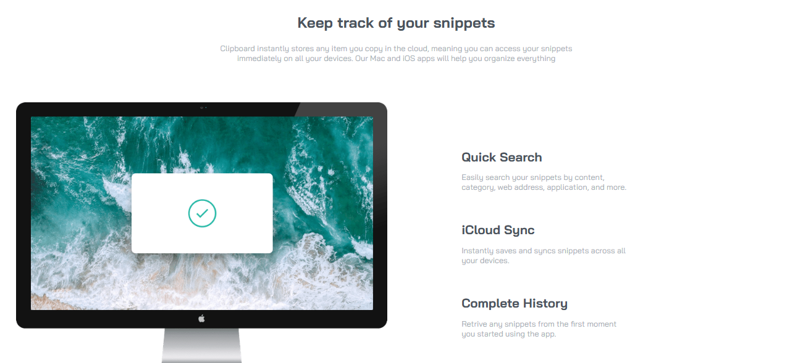

# 🚀 Frontend Mentor - Clipboard Landing Page solution

Projeto de landing page desenvolvido para treinamento de habilidades de estruturação e posicionamento de elementos, seguindo a semântica e garantindo a responsividade da página.

---

## 🎨 Layout

<div align="center">
  
  
  [Acesse o Projeto Online](https://marinasp13.github.io/clipboard-landing-page/)</br>
  [Acesse o Repositório do Projeto](https://github.com/marinasp13/clipboard-landing-page)</br>
  [Reportar Bug](https://github.com/marinasp13/clipboard-landing-page/issues)</br>
  
</div>

---

## 💻 Sobre o Projeto

Este projeto foi desenvolvido com o objetivo de criar uma landing page que proporcione uma boa experiência ao usuário. Através dele, busquei aplicar conceitos de estruturação dos elementos com HTML, estilização e posicionamento dos elementos com CSS e layout responsivo com media queries para criar uma solução eficiente e intuitiva.
<!-- 
### ✨ Principais Funcionalidades:
- **[Funcionalidade 1]:** Descrição breve do que faz.
- **[Funcionalidade 2]:** Descrição breve do que faz.
- **[Funcionalidade 3]:** Descrição breve do que faz.
-->
---

## 🛠 Tecnologias Utilizadas

As seguintes ferramentas e linguagens foram utilizadas na construção deste projeto:

- **Linguagem Principal:** HTML e CSS.
- **Versionamento:** Git & GitHub.
- **Hospedagem:** GitHub Pages.

---

## 🚀 Como Executar o Projeto

Caso queira rodar este projeto localmente na sua máquina, siga os passos abaixo:

```bash
# 1. Clone este repositório
$ git clone [https://github.com/marinasp13/clipboard-landing-page](https://github.com/marinasp13/clipboard-landing-page)

# 2. Acesse a pasta do projeto
$ cd clipboard-landing-page

# 3. Instale as dependências (se houver)
$ npm install

# 4. Execute a aplicação
# abra o index.html no navegador
```

---

## 🤝 Colaboradores 
Um agradecimento especial a todas as pessoas que contribuíram para este projeto.

<table>
  <tr>
    <td align="center">
      <a href="#">
        <br>
        <sub>
          <b>Marina Pereira</b>
        </sub>
      </a>
    </td>
  </tr>
</table>

---

## 📫 Contribuir
Deixe sua contribuição nesse projeto.
1. Clone o repositório.
2. Faça o checkout para sua branch usando a sintaxe: 
    -Feature (Adicionar nova funcionalidade)
    -Bugfix (Correção de bug)
    -Improvement (Melhoria)
3. Siga os padrões de commit.
4. Abra um Pull Request explicando seu trabalho realizado e aguarde a revisão! 🤝
